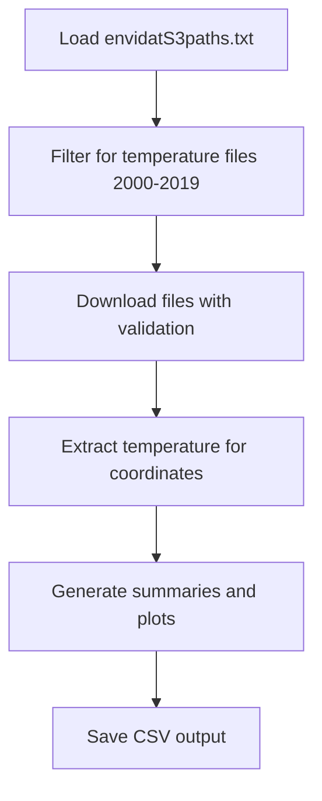

# CHELSA Temperature Data Extraction for Freshwater Ecology

[](https://www.r-project.org/)

## Authors

**Ariadna Garcia-Astillero** & **Nathan Jay Baker**

## Overview

This R script downloads and processes **CHELSA V2 monthly temperature data** for specific geographic coordinates, designed specifically for **freshwater ecology research**. The script extracts temperature time series data (2000-2019) from high-resolution climate data to support ecological analyses such as temperature-body size relationships in aquatic invertebrates.

## Background

[CHELSA (Climatologies at high resolution for the earth's land surface areas)](https://chelsa-climate.org/) provides high-resolution (~1 km) climate data based on mechanistic downscaling of global reanalysis data. This script was developed to overcome common challenges ecologists face when:

- Downloading large climate datasets programmatically
- Extracting temperature data for specific sampling sites
- Processing climate data for ecological analyses

## Features

- ✅ **Bulk download** of CHELSA V2 monthly temperature files (2000-2019)
- ✅ **Robust error handling** with download validation and file integrity checks
- ✅ **Automatic coordinate-based extraction** for multiple sampling sites
- ✅ **Data quality assessment** and summary statistics
- ✅ **Visualization** of temperature patterns and trends
- ✅ **Resume capability** - skips already downloaded files
- ✅ **Freshwater ecology focused** - designed for aquatic research applications

## Requirements

### R Packages

- NOTE: load tidyverse and then raster packages to avoid namespace conflicts (e.g., "extract")

```r
library(tidyverse)  # Data manipulation and visualization
library(raster)     # Spatial data processing
```

### Data Requirements
- **envidatS3paths.txt**: URL list file downloaded from CHELSA website
- **Sampling coordinates**: Longitude and latitude of your study sites

## Quick Start

### 1. Download CHELSA URL File
1. Visit the [CHELSA download page](https://envicloud.wsl.ch/#/?bucket=https%3A%2F%2Fos.zhdk.cloud.switch.ch%2Fchelsav2%2F&prefix=%2F)
2. Navigate to `GLOBAL/monthly/tas/`
3. Select which years and months you need (e.g., 2000-2019)
4. Download the `envidatS3paths.txt` file via the "Download only the selected files via Wget" option
4. Place it in your R working directory

### 2. Set Up Your Sampling Sites
```r
sampling_sites <- data.frame(
  SITE_ID = c("Site1", "Site2", "Site3", "Site4"),
  LON = c(your_longitude_values),  # Decimal degrees
  LAT = c(your_latitude_values),   # Decimal degrees
  stringsAsFactors = FALSE
)
```

### 3. Run the Script
The script will automatically:
- Filter for temperature data (2000-2019)
- Download missing files with validation
- Extract temperature values for your coordinates
- Generate summary statistics and visualizations
- Save results as CSV file

## Output

### Data Files
- **CHELSA_temperature_data_YYYYMMDD.csv**: Main temperature dataset with columns:
  - `SITE_ID`: Site identifier
  - `LON`, `LAT`: Coordinates
  - `YEAR`, `MONTH`: Temporal information
  - `TEMPERATURE_C`: Temperature in Celsius

### Visualizations
- **Monthly temperature boxplots** by site
- **Annual temperature trends** with linear fits

### Summary Statistics
- Data completeness assessment
- Site-specific temperature summaries
- Monthly and annual temperature patterns

## Example Use Cases

This script is particularly useful for:

- **Freshwater biodiversity**: Understanding thermal habitat conditions
- **Climate change studies**: Long-term temperature trend analysis
- **Species distribution modeling**: Environmental variable preparation
- **Phenology studies**: Seasonal temperature pattern analysis

## Script Workflow



## Error Handling

The script includes robust error handling for:
- **Network issues**: Automatic retry and progress tracking
- **File corruption**: Size validation and TIFF format verification
- **Missing data**: Quality assessment and reporting
- **Server problems**: Graceful failure with informative messages

## Customization

### Modify Time Period
```r
# Change the regex pattern for different years
pattern <- "tas.*_(2010|201[0-9])_"  # For 2010-2019
```

### Adjust Error Tolerance
```r
max_allowed_errors <- 5  # Increase for less strict error handling
```

### Add More Sites
Simply expand the `sampling_sites` data frame with additional coordinates.

## Performance Notes

- **File sizes**: Each CHELSA file is ~100-200 MB
- **Total download**: ~48 GB for 20 years of monthly data (240 files)
- **Processing time**: ~2-5 minutes per file for coordinate extraction
- **Memory usage**: Moderate (each raster loaded individually)

## Troubleshooting

### Common Issues

**Download failures:**
- Check internet connection and CHELSA server status
- Verify `envidatS3paths.txt` file format (no extra spaces)
- Ensure sufficient disk space (~50 GB)

**Coordinate extraction errors:**
- Verify coordinates are in decimal degrees (WGS84)
- Check that coordinates fall within land areas covered by CHELSA
- Ensure raster files are not corrupted

**Package conflicts:**
- Use `tidyverse` instead of loading individual packages
- Restart R session if experiencing namespace conflicts

## Citation

If you use this script in your research, please cite:

**CHELSA Data:**
> Karger, D.N., Conrad, O., Böhner, J., Kawohl, T., Kreft, H., Soria-Auza, R.W., Zimmermann, N.E., Linder, H.P. & Kessler, M. (2017) Climatologies at high resolution for the earth's land surface areas. *Scientific Data* 4, 170122.

## Contributing

Contributions are welcome! Please feel free to:
- Report bugs or issues
- Suggest improvements
- Add features for different ecological applications
- Improve documentation

## License

This code is released under the MIT License and comes with **ABSOLUTELY NO WARRANTY**. It is intended to help the research community and is provided free of charge.

*This R code is free, intended to help the community, and comes with ABSOLUTELY NO WARRANTY.*

---

## Related Resources

- [CHELSA Official Website](https://chelsa-climate.org/)
- [CHELSA Data Download](https://envicloud.wsl.ch/)
- [R Spatial Data Analysis](https://rspatial.org/)
- [Freshwater Ecology Resources](https://freshwaterecology.info/)

---

*Developed for the freshwater ecology community - making climate data accessible for aquatic research*
